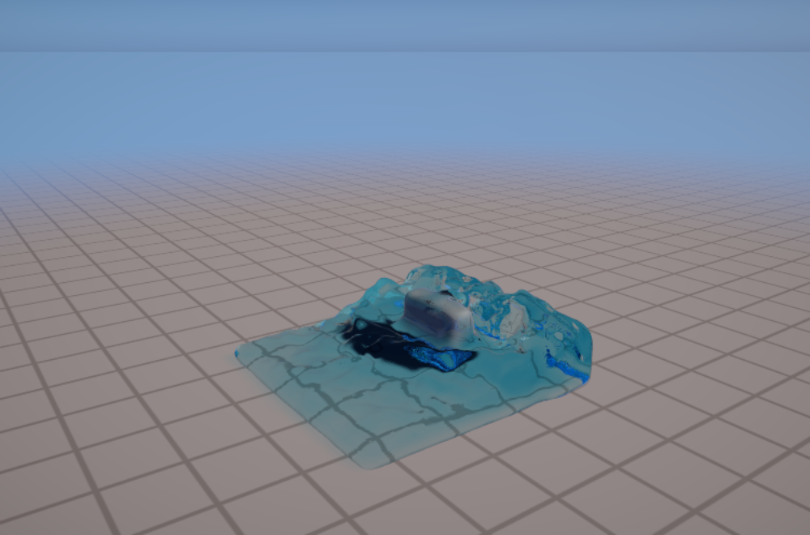
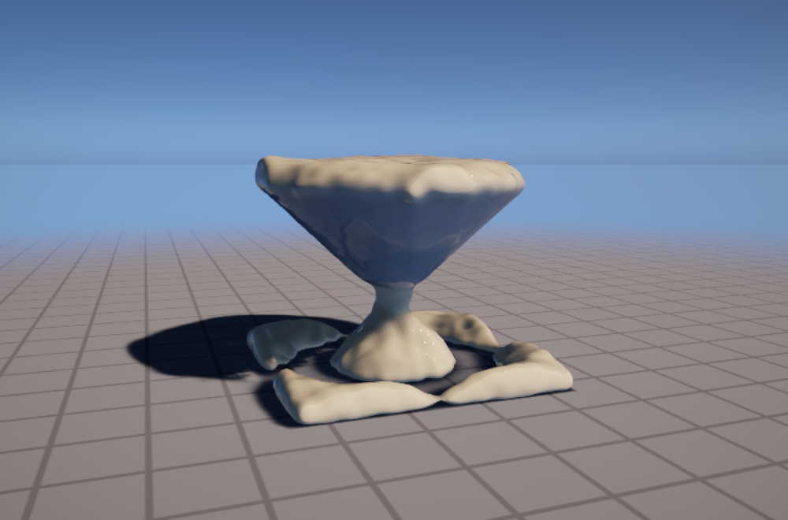
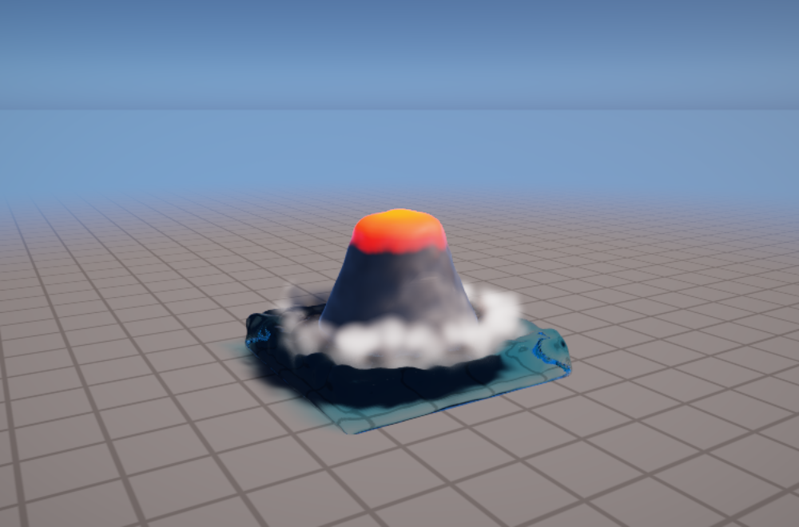
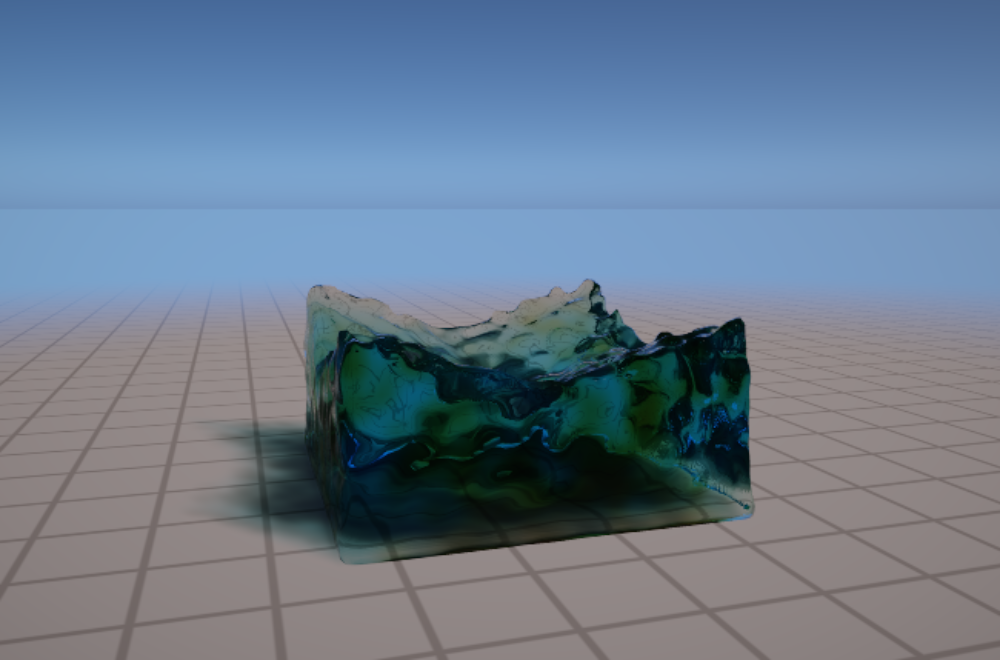
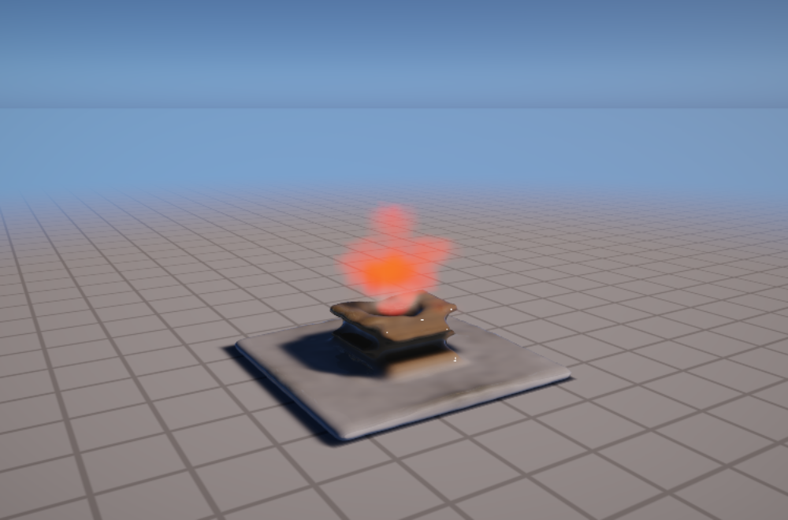
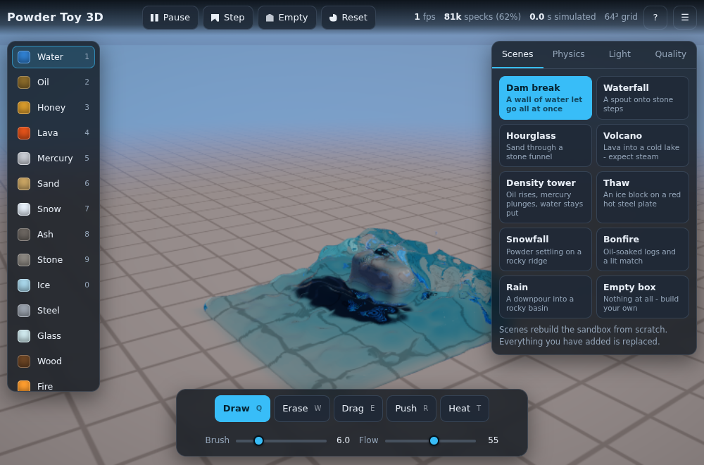

# Powder Toy 3D

A physics sandbox in three dimensions. Pour water, tip sand, melt ice on hot steel,
pour lava into a lake and watch it flash to steam — all of it worked out from the
actual equations, and drawn with a ray tracer.

It is **one HTML file**. Download it, double-click it, and it runs offline. Nothing
to install, nothing to sign up for, no network access at all.



## Getting started

Download **`Powder Toy 3D.html`** from this repository and open it in Chrome, Edge,
Firefox or Safari. You need a machine with WebGL 2 — anything from roughly the last
ten years, including integrated graphics. If it will not start, the page says why.

## Controls

| | |
| --- | --- |
| **Left drag** | Use the current tool on whatever is under the pointer |
| **Right drag** | Orbit the camera |
| **Middle drag** | Slide the camera sideways |
| **Wheel** | Move closer or further away |
| **Shift + wheel** | Change the brush size |
| **Ctrl + wheel** | Push the brush deeper into the scene, or pull it back |
| **1–9, 0** | Pick a material |
| **Q W E R T** | Draw, Erase, Drag, Push, Heat |
| **Space** | Pause or resume · **.** one frame · **Backspace** empty the box |
| **[** and **]** | Brush smaller or larger · **Tab** settings · **H** help |

Hold **Shift** with Push to suck material in instead of blowing it out, and with
Heat to chill instead of warm.

## What is in the box

Sixteen materials, each with its real density, viscosity, friction, surface tension
and melting point:

**Liquids** — water, oil, honey, lava, mercury.
**Powders** — sand, snow, ash.
**Fixed** — stone, ice, steel, glass, wood.
**Gases** — steam, smoke, fire.

They interact the way you would expect. Oil floats on water and mercury sinks
through both. Lava sets into stone as it cools, and boils any water it touches into
steam. Ice melts, water freezes, sand fuses into glass at 1600 °C, wood and oil
catch light and leave smoke behind. Sand heaps up at its angle of repose instead of
levelling out like a liquid.

## Nine places to start

Dam break · Waterfall · Hourglass · Volcano · Density tower · Thaw · Snowfall ·
Bonfire · Rain — plus an empty box to build in.

| Hourglass | Volcano |
| --- | --- |
|  |  |

Sand heaps up because it is a Coulomb material, not a liquid. Lava glows orange
because Planck's law says a body at 1150 °C glows orange.





The whole thing, with the panels open:



## How it works

Short version: the specks carry the material, the heat and the momentum; a
background grid handles everything that needs to know about neighbours. Each step
scatters the specks onto that grid, adds weight and buoyancy, spreads heat, applies
surface tension, and then solves a pressure equation that removes any divergence
from the velocity field — which is what makes water behave like water rather than
like dust. The picture is made by marching rays through those same fields.

The long version, including an honest list of where the model departs from reality
and why, is in **[docs/PHYSICS.md](docs/PHYSICS.md)**.

## For the technically minded

Source lives in `src/`. There is no bundler: the app is plain ES2020 script chunks
plus GLSL in template literals, and the build concatenates them in filename order
and inlines the result into `src/index.html`.

| Command | What it does |
| --- | --- |
| `npm run build` | Write `Powder Toy 3D.html` (`--dev` keeps comments and blank lines) |
| `npm test` | Unit tests for the pure logic, the material table and the bundle |
| `npm run test:browser` | Drive the built file in headless Chromium: shaders, physics, controls |
| `npm run check` | All of the above |

```
src/index.html          page shell
src/styles.css          all the styling
src/js/01-math.js       vectors, matrices, ray/box, low-discrepancy sequences
src/js/02-materials.js  the material table and how it is packed for the GPU
src/js/03-scenes.js     starting arrangements
src/js/10-gl.js         a thin WebGL2 layer
src/js/20-glsl-*.js     shaders: shared prelude, solver, particles, renderer, post
src/js/30-sim.js        the solver: owns every texture, runs the passes in order
src/js/40-render.js     the renderer: camera, caustics, tone mapping, picking
src/js/50-camera.js     orbit camera
src/js/60-input.js      mouse, touch and keyboard
src/js/70-ui.js         the panels
src/js/90-main.js       boot and the frame loop
```

`window.PowderToy` is exposed for the console and for the tests: the settings
objects (`PHYSICS`, `RENDER`, `QUALITY`), the live `sim` and `renderer`, and
`advance(n)` / `drawOnce()` so the physics can be stepped without drawing.

Every setting in the panel is a real number in the solver, so you can turn gravity
off, make water infinitely thin, or run the whole thing in slow motion. **Quality →
Show** swaps the finished picture for what the solver is actually thinking:
temperature, speed, pressure, surface normals, how much sunlight reaches each point.
